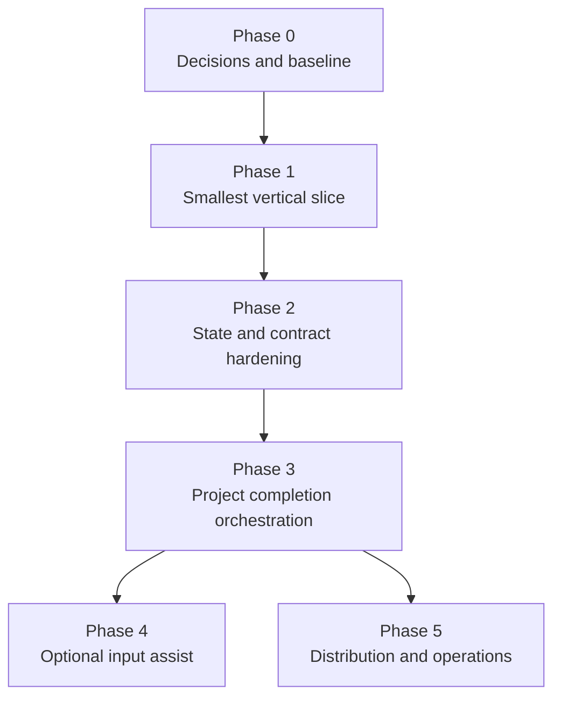

# ChatGPT Web Call Assistant — Implementation and Verification Roadmap

**Status:** Proposed execution plan; no implementation is claimed  
**Prepared:** 2026-07-14  
**Depends on:** `CHATGPT_WEB_CALL_ASSISTANT_SYSTEM_DESIGN.md`

## 1. Outcome and rollout rule

The recommended rollout builds a **thin Chrome MV3 side-panel extension plus a local native-messaging companion**, while preserving the current manual exchange process as an always-available fallback.

The first release will assist—but will not secretly automate—the ChatGPT Web boundary:

- **Go:** exact review, authorization, open ChatGPT, copy prompt, reveal prepared files.
- **User:** attach, review, and press ChatGPT Send.
- **User:** review and download response files using ChatGPT controls.
- **Done:** explicit native file selection, safe collection, binding, validation, and status update.

The implementation MUST NOT start with DOM scraping, automatic Send, automatic response extraction, cookies, Chrome debugger access, private ChatGPT endpoints, or broad download/page permissions. Current OpenAI Terms prohibit automatic/programmatic extraction of data or output; the architecture therefore keeps response transfer user-mediated. ([OpenAI Terms of Use](https://openai.com/policies/terms-of-use/), accessed 2026-07-14.)

Each phase has an independent exit gate and rollback. A failed phase leaves the manual protocol functional and does not rewrite legacy exchanges.

## 2. Dependency order

Phase 4 is optional and may remain permanently deferred. Phase 5 may begin in parallel with late Phase 3 only after the security model and contracts are stable.

## 3. Global implementation rules

1. The current manual protocol MUST remain documented and runnable.
2. Legacy exchange folders MUST be treated as read-only fixtures.
3. Every release MUST be reversible by disabling the extension and returning to manual transport.
4. Every persisted state transition MUST be transactional, versioned, and idempotent.
5. The extension MUST remain non-authoritative; restart recovery comes from the companion.
6. Every permission added to the extension MUST have a current feature, a threat analysis, and an explicit test. No future-proof permissions.
7. Live ChatGPT testing MUST be manual UAT. Automated browser tests MUST use a local mock surface, not Sina’s authenticated account.
8. Model output and returned files MUST be treated as untrusted data and never executed.
9. No phase may claim completion from a green happy-path test alone; failure injection and rollback evidence are mandatory.
10. Future edits to the F1D codebase MUST follow `F1D_AGENTS.md`: run GitNexus impact analysis before editing symbols, warn on high/critical blast radius, run `detect_changes()` before commit, and inspect the relevant GitNexus skill instructions.

## 4. Phase 0 — approve decisions, inventory the repository, and freeze the baseline

### Objective

Convert the candidate design into an approved implementation contract and create a reproducible baseline of the working manual workflow.

### Inputs

- Product brief, protocol, schemas, examples, and repository instructions supplied in the design exchange.
- Sina’s decisions on automation ceiling, Done collection, bridge type, v3 contracts, and project-root strategy.
- The actual F1D repository and current exchange history.
- Primary environment: Windows 10/11 and current stable Chrome.

### Scope and deliverables

- An approval record for open decisions 1–5 in the system design.
- Repository architecture map and GitNexus freshness/status record.
- Inventory of all legacy exchange folders, their manifest/schema versions, hashes, and anomalous layouts—without modifying them.
- Golden fixtures copied from representative v2 exchanges into a test-fixture area.
- A written manual end-to-end baseline with measured user actions and failure behavior.
- Threat-model sign-off and permission budget.
- Chosen project exchange-root convention.
- Chosen Node.js LTS, package manager, SQLite binding, JSON Schema validator, test runner, formatter, and installer approach, all pinned.
- Definition of Done for Phase 1.

### Affected components

Planning and test fixtures only. No production extension or companion behavior.

### Prerequisites

- Sina approves the baseline as **manual Send/download plus Go/Done assistance**.
- Sina approves native messaging and native file selection.
- The repository and GitNexus index are available.

### Principal risks

- Existing exchanges may not follow one consistent layout.
- Repository instructions may impose additional build/test constraints.
- A chosen SQLite/installer dependency may complicate Windows packaging.

### Automated tests/evidence

- Hash inventory is stable across two runs.
- Every selected legacy request and response JSON is classified as valid, invalid, or unknown under its declared schema.
- No legacy fixture changes after inventory (`git diff`/hash comparison).
- Toolchain smoke test on a clean Windows user profile or equivalent CI image.

### Manual tests/evidence

- Sina completes one existing manual exchange using the documented process.
- Record the exact actions, points of uncertainty, and recovery steps.
- Confirm that disabling all proposed tooling leaves the current process unchanged.

### Exit criteria

- Decisions 1–5 are approved and recorded.
- Legacy inventory is complete enough to cover every observed format class.
- Golden v2 fixtures and negative fixtures exist.
- The threat model, permission budget, and Phase 1 Definition of Done are accepted.
- No production file has been modified.

### Rollback

Delete only newly created planning/test-fixture material if rejected. Legacy exchanges remain untouched.

### Deferred

Extension UI, native host, v3 production state, project completion graph, DOM assist, distribution.

## 5. Phase 1 — smallest coherent end-to-end vertical slice

### Objective

Prove that one real bounded call can travel from an existing prepared exchange through **Go**, manual ChatGPT send/download, **Done**, deterministic validation, and durable status without scraping ChatGPT or losing the manual fallback.

### User-visible demonstration

1. Codex/manual tooling prepares one test exchange.
2. The side panel shows project, task, prompt, exact files, hashes, and expected outputs.
3. Sina presses Go.
4. Chrome opens the configured ChatGPT destination; the extension copies the prompt only when Sina clicks Copy and the companion reveals the request folder.
5. Sina attaches files and presses ChatGPT Send.
6. Sina reviews and downloads the main JSON and artifact.
7. Sina presses Done; a native Windows file picker opens.
8. Sina selects the downloaded files.
9. The companion stores and validates them, shows precise pass/fail results, and writes an auditable state/event record.
10. The same call can be recovered after restarting Chrome.

This is the smallest coherent slice because it validates the architecture’s two trust boundaries—browser-to-local and user-to-ChatGPT—without first building full project intelligence.

### Scope and deliverables

#### Local companion core

- Project-root configuration for one pilot project.
- SQLite database with migrations for `call`, `event`, `package_file`, `expected_output`, `collection`, `response_file`, and `validation_run`.
- State subset: `READY`, `HANDOFF_ACTIVE`, `COLLECTING`, `COLLECTED`, `VALIDATING`, `ACCEPTED`, `NEEDS_CORRECTION`, `FAILED`, and pause metadata.
- Optimistic `state_version`, per-call lock, and command idempotency table.
- Read-only loader for one v2 legacy exchange type.
- Package re-hash and request-disclosure endpoint.
- Native commands: `health`, `list_ready_calls`, `get_call_disclosure`, `authorize_go`, `reveal_request_folder`, `begin_collection_picker`, `validate_collection`, `pause`, and `resume`.
- Atomic response copy using exchange-local staging and hash verification.
- v2 main-response schema validation, request-ID check, expected-filename check, and artifact-manifest/hash accounting.
- Metadata-only local log and `EVENTS.jsonl` mirror.

#### Native messaging

- Per-user Windows registration under HKCU for one exact extension ID.
- Version handshake and health response.
- Strict schemas for every message.
- Nonces, state versions, idempotency keys, command allowlist, size limits, and timeout behavior.
- No arbitrary shell command, arbitrary path read, arbitrary URL open, or file-byte transfer.

Chrome documents exact `allowed_origins`, per-platform host registration, and native-message framing/size limits. These constraints MUST be covered by tests. ([Chrome native messaging](https://developer.chrome.com/docs/extensions/develop/concepts/native-messaging), accessed 2026-07-14.)

#### MV3 extension

- Side panel with Ready, Active, Paused, and validation-result views.
- Calm disclosure screen with prompt, exact files, sizes, hash prefixes, purposes, and expected outputs.
- Go with idempotent loading/result behavior.
- Open/focus ChatGPT tab without broad `tabs` permission.
- User-click Copy prompt and Reveal folder.
- Done invokes the companion’s native picker and shows expected/selected files before commit.
- Recovery view when Chrome restarts or native host disconnects.
- Baseline permissions only: `sidePanel`, `nativeMessaging`, and `storage`; any clipboard permission must be justified by a compatibility test.
- No content script, host permission, downloads permission, cookie access, debugger access, or remote code.

#### Manual fallback

- One command/view exports the exact legacy request folder and current manual instructions.
- The extension displays fallback steps when health checks fail.
- Disabling the extension does not lock or corrupt a call.

### Affected components

New companion package, extension package, installer/dev-registration script, schemas, fixture tests, and documentation. Legacy production exchanges remain read-only.

### Prerequisites

- Phase 0 complete.
- Exact test exchange selected.
- Windows/Chrome versions recorded.
- Repository impact analysis completed before editing existing symbols.

### Principal risks

- Native picker window ownership/focus may be inconsistent.
- Chrome service worker may terminate between actions.
- Browser-download names may contain `(1)` or other uniquification.
- SQLite native dependency packaging may fail on a clean Windows machine.
- User may be uncertain whether a ChatGPT message was sent.

### Deterministic unit tests

- State transition preconditions and forbidden transitions.
- Optimistic version conflict.
- Duplicate Go and Done idempotency.
- Request re-hash mismatch blocks Go.
- Filename normalization, case collision, reserved Windows names, traversal, absolute paths, symlinks/reparse points.
- Stable/unstable file detection.
- Atomic copy cleanup on injected failure.
- v2 schema-valid/invalid response parsing.
- Request-ID mismatch.
- Artifact missing, extra, duplicate, hash mismatch, null hash, wrong MIME, and browser-uniquified filename.
- Parser byte/depth/item limits.
- Log redaction.

### Contract tests

- Every extension↔native command validates both directions.
- Unknown fields/commands/versions are rejected.
- Host response cannot exceed the documented limit; file bytes never appear.
- Replayed idempotency keys return the original logical result.
- Malformed or attacker-crafted content-script-like messages cannot trigger file operations.

### Extension tests

- Side panel can open from a user gesture and restore its view.
- Service worker termination between disclosure and Go does not lose state.
- Native host absent, version mismatch, timeout, and disconnect produce actionable fallback.
- Permission manifest contains only the approved baseline.
- UI renders text with safe text APIs; injected HTML/script fixtures do not execute.
- Browser tab IDs are discarded/rebound after restart.

Chrome says MV3 service-worker global variables may be lost and durable values should be stored; this test is mandatory. ([Service-worker lifecycle](https://developer.chrome.com/docs/extensions/develop/concepts/service-workers/lifecycle), accessed 2026-07-14.)

### Local integration and failure-injection tests

- Crash before/after SQLite commit.
- Crash during response copy and after copy but before state commit.
- Locked source/target file.
- Disk-full simulation.
- Permission denied.
- Corrupt database copy and rebuild rehearsal from manifests/events.
- Two simultaneous Done attempts.
- Two calls in different projects attempting collection.
- Stale lock recovery.
- Chrome restart and companion restart at every lifecycle boundary.

### Browser integration tests

Use Playwright with its bundled Chromium persistent context to load the extension against a **local mock ChatGPT page**. The mock simulates delayed answers, missing artifacts, renamed files, interrupted downloads, and UI changes. Playwright’s extension guidance requires a Chromium persistent context; automated tests MUST NOT load Sina’s authenticated ChatGPT state. ([Playwright Chrome extensions](https://playwright.dev/docs/chrome-extensions), accessed 2026-07-14.)

### Manual UAT

- One happy-path real ChatGPT call using non-sensitive fixtures.
- Go review catches an intentionally wrong outgoing file before send.
- Chrome closes after Go; user recovers without duplicate submission.
- Done is pressed too early and explains what is missing.
- User selects a wrong response; it is quarantined and not accepted.
- User selects the correct response with a `(1)` suffix; binding is resolved by content/schema and explicitly shown.
- Missing artifact produces `NEEDS_CORRECTION`, not Accepted.
- Disable extension and complete the same fixture manually.

### Acceptance evidence

- Screen recording or timestamped UAT checklist of the non-sensitive call.
- SQLite/event log and filesystem exchange agree after restart.
- All negative tests show no silent state advancement.
- Permission manifest and code audit show no scraping/download/cookie/debugger capability.
- Hashes prove no legacy fixture changed.
- Manual fallback succeeds.

### Exit criteria

- 100% pass on deterministic state/contract/path/security tests.
- Required failure-injection cases pass on Windows.
- At least one real non-sensitive UAT call completes and validates.
- Restart recovery works before, during, and after Go/Done.
- No critical/major security finding remains open.
- Sina approves the vertical slice’s actual number of actions and messages.

### Rollback

- Disable/uninstall extension.
- Remove per-user native-host registration.
- Stop using the new SQLite index.
- Continue with original exchange folders and manual protocol.
- Never delete collected evidence; mark the pilot database retired and preserve it for audit.

### Deferred

v3 Web contracts, full legacy import, requirement graph, correction-call generation, automatic project completion, optional input composer assist, signed distribution, telemetry, cross-platform installers.

## 6. Phase 2 — harden contracts, state, migration, and recovery

### Objective

Move from a one-project pilot to a durable multi-project exchange engine with v3 identity binding, complete state transitions, legacy compatibility, and deterministic reconciliation.

### Scope and deliverables

- JSON Schemas for `PROJECT_MANIFEST`, `EXCHANGE_MANIFEST` v3, `PACKAGE_MANIFEST`, request v3, response v3, `CALL_STATE`, `COLLECTION_REPORT`, `VALIDATION_REPORT`, and event records.
- RFC 8785 canonicalization plus SHA-256 package digest implementation and cross-language test vectors.
- Full state machine, pause/resume, stale, rejected, canceled, failed, integrating/integrated.
- Parent/child correction, revision, critic, integration, and final-audit lineage.
- Complete legacy read-only importer with format classification.
- SQLite rebuild/reconciliation command from filesystem evidence.
- Multi-project query and per-project integration locks.
- Material-staleness rules and user reapproval flow.
- Quarantine management without automatic deletion.
- Current upload-limit configuration and visible preflight.
- Data sensitivity, secret scanning, documented override, and retention-choice record.

### Prerequisites

- Phase 1 accepted.
- v3 migration decision confirmed.
- Schema-validator support for Draft 2020-12 selected and pinned. ([JSON Schema specification](https://json-schema.org/specification), accessed 2026-07-14.)

### Principal risks

- Conditional schema rules become too complex to maintain.
- Canonicalization differences cause digest divergence.
- Legacy inference overstates what old evidence proves.
- Secret scan false positives/negatives create user friction or false confidence.

### Automated tests

- Official and custom RFC 8785 vectors, Unicode, ordering, and number-edge cases.
- Every v3 conditional completion rule.
- Exactly-once W/Q/A ID coverage.
- Created artifact requires hash/size; complete response requires complete delivery.
- Legacy v2 fixtures remain valid under v2 and are never rewritten.
- Every state/transition/retry classification and crash boundary.
- Concurrent reads/writes, lock timeout, state-version race, and deadlock avoidance.
- Database rebuild matches the pre-loss logical state or reports explicit ambiguity.
- Secret patterns, entropy cases, exclusions, binary files, and override audit.

### Manual tests

- Import several real legacy exchange variants and review inferred states.
- Run two concurrent projects without cross-call display or collection.
- Change one frozen request byte and confirm Go requires repackaging/reapproval.
- Create a correction child call from a missing artifact and verify lineage.

### Acceptance evidence

- Published schema bundle with example-valid and example-invalid fixtures.
- State-transition coverage report with no untested allowed transition.
- Legacy import report showing zero source mutations.
- Rebuild drill from a deleted pilot database.
- Concurrency and crash-injection report.

### Exit criteria

- v3 contracts validate all required invariants.
- Dual v2/v3 validator passes full fixture suite.
- Reconciliation is deterministic for documented cases and fails closed for ambiguous cases.
- No cross-project response association is possible in negative tests.
- Privacy and secret controls are accepted by Sina.

### Rollback

Keep the Phase 1 database/schema reader and manual mode. New v3 exchanges remain self-contained and can be handled manually from their folders even if the upgraded index is disabled.

### Deferred

Automatic requirement planning, integration into Codex project control, optional DOM input assist, cross-platform packaging.

## 7. Phase 3 — whole-project orchestration and completion proof

### Objective

Implement the product’s central promise: Codex tracks the complete objective across bounded calls and can prove—not merely assert—when the project is complete.

### Scope and deliverables

- Project objective, requirements, tasks, dependencies, milestones, outputs, open issues, and approvals.
- Persistent labor-versus-intellectual triage record.
- Typed call templates: architect, specialist, critic, revision, integration, and final audit.
- Requirement-to-call-to-output-to-validation-to-integration traceability.
- Milestone pause/review controls.
- Correction-call generator that includes original request, response hashes, precise deficiencies, and requested repair.
- Acceptance and integration separation.
- Project completion engine and `PROJECT_COMPLETION.json`.
- Side-panel project dashboard showing next call, completed evidence, blockers, and what Codex will do next.
- Codex-facing CLI/contract for listing ready calls and recording validation/integration outcomes.

### Prerequisites

- Phase 2 contracts and state machine stable.
- Sina approves requirement/status vocabulary and completion policy.
- At least two representative multi-call projects available as fixtures.

### Principal risks

- Mechanical coverage may be mistaken for intellectual correctness.
- Automated task decomposition may create unnecessary calls.
- Requirement changes may invalidate accepted downstream outputs.
- Integration may touch high-risk repository symbols.

### Automated tests

- Dependency cycles and unreachable tasks rejected.
- Requirement status cannot be Satisfied without accepted evidence.
- Accepted output is not Integrated until integration evidence passes.
- Project cannot be Complete with missing artifacts, open critical issues, unresolved contradictions, unintegrated mandatory outputs, or missing final audit.
- Changing a governing requirement marks affected evidence stale through explicit dependency edges.
- Correction calls are unique and linked; repeated generation is idempotent.
- Multi-project dashboards never mix IDs or files.

### Manual tests

- End-to-end mock thesis/research project with planning, specialist, critic, revision, integration, and final audit calls.
- User pauses at a milestone, changes a requirement, and resumes with affected calls correctly invalidated.
- User rejects a model output and verifies no integration occurs.
- Codex spot-checks a structurally valid but factually wrong fixture and blocks acceptance.

### Acceptance evidence

- Requirement traceability export for each representative project.
- Demonstration that call count alone cannot satisfy completion.
- Final-audit and user-approval record.
- Integration rollback test following repository-specific impact analysis.

### Exit criteria

- Every original requirement can be traced to current accepted and integrated evidence or an explicit user-approved exception.
- Completion engine passes all negative fixtures.
- Codex semantic-validation interface is usable without bypassing user decisions.
- Sina can pause, reject, redirect, and inspect what remains.

### Rollback

Disable automatic next-call/project-completion suggestions while retaining Phase 2 exchange handling. Existing calls remain usable manually.

### Deferred

Input composer automation, broad distribution, cross-browser support, external telemetry.

## 8. Phase 4 — optional input-only ChatGPT composer assistance

### Objective

Explore whether Go can safely reduce prompt/file staging actions without weakening user control, depending on current OpenAI rules and live UI behavior.

### Entry gate

This phase MUST NOT begin unless all are true:

- OpenAI’s current terms/policies have been re-reviewed and the intended behavior is approved as compliant.
- Sina explicitly opts in.
- The feature is input-only: it never reads/extracts responses or clicks Send.
- A manual fallback is visible and tested.
- Optional/temporary ChatGPT host access is approved and narrowly scoped.

### Candidate scope

- Optional content-script adapter invoked only on an explicitly authorized call.
- Capability probe using accessible names/roles rather than deep CSS paths where possible.
- Stage prompt and possibly user-approved files in the composer, then stop for user review and native Send.
- Exact on-page preview comparison against the frozen package.
- Selector/behavior adapter version, compatibility result, and kill switch.

### Explicit exclusions

- No response DOM reading.
- No network interception.
- No cookies/session token access.
- No private endpoints.
- No automatic Send, retry, or continuation.
- No hidden background tab operation.
- No access outside the bound ChatGPT tab.

### Principal risks

- UI changes cause wrong composer/file attachment.
- ChatGPT may use shadow DOM, virtualized controls, or upload flows unsuitable for safe automation.
- Host access expands the extension’s compromise impact.
- Input automation may be disallowed or unsupported despite technical feasibility.

### Tests

- Local mock versions of old/new/unknown UI.
- Feature refuses operation when confidence is below threshold.
- Every staged filename/hash shown for user confirmation.
- Page navigation or tab change revokes binding.
- Malicious page cannot request arbitrary local files or native commands.
- Kill switch returns immediately to Phase 3 manual staging.
- Manual live UAT only, using non-sensitive fixtures.

### Exit criteria

- Policy and security approval documented.
- No automatic output extraction or Send exists in code/permissions.
- Unknown UI always fails closed.
- Manual fallback completes every failed staging case.
- Sina judges the reduced actions worth the added permission/brittleness.

### Rollback

Disable the feature flag and revoke optional host permission. Core Go/Done behavior remains unchanged.

### Deferred indefinitely unless separately approved

Download monitoring, response scraping, automatic Send, or authenticated browser automation.

## 9. Phase 5 — packaging, security hardening, and operations

### Objective

Turn the accepted pilot into a maintainable personal/private product with safe installation, updates, diagnostics, and recovery.

### Scope and deliverables

- Signed/versioned extension and companion releases.
- Windows per-user installer/uninstaller with exact native-host registration and rollback.
- SBOM, dependency lock, license inventory, vulnerability scanning, and update policy.
- Extension CSP/no-remote-code audit.
- Database backup, integrity check, migration backup, and disaster-recovery guide.
- Metadata-only support bundle with explicit preview/redaction.
- Privacy notice and permission rationale.
- Release compatibility matrix for supported Chrome and Windows versions.
- Optional macOS/Linux native-host adapters only after Windows stability.
- Distribution decision: private signed package or Chrome Web Store submission.

Chrome Web Store policy requires transparent data practices and the narrowest necessary permissions. A permission/privacy audit is therefore a release gate. ([Chrome Web Store User Data FAQ](https://developer.chrome.com/docs/webstore/program-policies/user-data-faq), accessed 2026-07-14.)

### Prerequisites

- Phases 1–3 stable; Phase 4 not required.
- No unresolved critical/major security issue.
- Data-retention and update decisions approved.

### Tests

- Clean install, upgrade, downgrade rejection, uninstall, reinstall, and corrupted-install recovery.
- Native host origin pinning and extension-ID mismatch.
- Database migration interruption and rollback.
- Dependency/tamper/signature checks.
- Least-privilege manifest diff.
- Support bundle contains no prompt/output bodies, credentials, absolute sensitive paths, or raw filenames when redaction is selected.
- Manual fallback from every installer/update failure.

### Exit criteria

- Clean-machine UAT passes.
- Security review and permission audit pass.
- Backup/restore and database rebuild drills pass.
- Installer rollback restores manual operation.
- Sina approves distribution and update behavior.

### Rollback

Uninstall extension/native host while preserving exchange folders and exported database backup. Resume manual protocol.

## 10. Consolidated test matrix

| Area | Normal cases | Failure/attack cases | Required evidence |
|---|---|---|---|
| Package creation | valid files, hashes, disclosure | changed byte, missing file, unsafe name, symlink, secret, over limit | deterministic unit/fixture report |
| State machine | complete lifecycle, pause/resume | illegal transition, stale version, replay, crash at each boundary | transition coverage and event audit |
| Native messaging | health, commands, reconnect | wrong origin/version, malformed/oversized/replayed message, host exit | contract/security tests |
| Extension | side panel, Go/Done, restart | worker termination, permission denial, missing host, lost tab | extension integration report |
| Collection | correct JSON/artifacts | wrong call, partial/locked file, duplicate suffix, extra/missing/hash mismatch | quarantine and no-advance evidence |
| Schema | valid v2/v3 | missing IDs, conditional COMPLETE violation, null created hash, extra properties | positive/negative contract fixtures |
| Semantic review | supported output | authoritative conflict, invented citation, incomplete criterion | Codex validation record |
| Integration | accepted merge and verify | dirty/high-risk target, test failure, crash, rollback | repository-specific report |
| Project completion | all evidence satisfied | missing artifact, unresolved blocker, unintegrated output, no final audit | completion negative fixtures |
| Privacy/security | approved non-sensitive call | unrelated file, malicious JSON/HTML, log injection, credential pattern | threat-control test report |
| Compatibility | supported Chrome/Windows | UI change, extension update, DB migration | compatibility matrix |
| Fallback | manual exchange | tooling unavailable/corrupt | successful manual UAT |

## 11. Mandatory release gates

### Gate A — architecture

- Open decisions 1–5 approved.
- No reliance on undocumented ChatGPT APIs.
- No automatic output extraction.

### Gate B — correctness

- All deterministic unit/contract tests pass.
- State transition coverage is complete.
- v2 regression fixtures unchanged.

### Gate C — security/privacy

- No unresolved critical/major finding.
- Extension permissions equal approved budget.
- No cookies/debugger/downloads/all-sites permission in baseline.
- Secret/sensitivity and path-safety tests pass.

### Gate D — reliability/recovery

- Crash/restart at every boundary does not silently advance or lose evidence.
- Duplicate actions are idempotent.
- Database rebuild and manual fallback pass.

### Gate E — user acceptance

- Sina completes Go→Send→Download→Done without developer intervention.
- Outgoing files and expected outputs are understandable.
- Missing/wrong files produce clear recovery.
- The number of required actions is accepted.

No pilot release may cross a failed gate by relabeling it “known limitation.” A gate exception requires Sina’s explicit written approval, bounded scope, expiry, and rollback.

## 12. Rollback criteria

Rollback to the prior phase or manual mode if any of the following occurs:

- any call is sent without explicit authorization;
- any unrelated page content or response content is silently collected;
- a wrong-call response reaches Accepted or Integrated;
- a frozen request changes without invalidating approval;
- duplicate Go/Done causes duplicate logical work or overwrites different bytes;
- state cannot be reconciled after a supported crash scenario;
- extension permissions exceed the reviewed manifest;
- current OpenAI or Chrome policy makes the behavior non-compliant;
- a critical security issue is discovered;
- the manual fallback is no longer usable.

Rollback means disabling the affected automation, preserving all evidence, marking impacted calls with an operational incident, and resuming manual transport. It never means deleting or rewriting legacy history.

## 13. First-slice Definition of Done

Phase 1 is complete only when all statements are true:

- One extension build and one companion build are reproducible from a clean checkout.
- The native host is registered to exactly the pilot extension ID.
- The side panel displays one real prepared call with exact disclosure.
- Go is user-authorized, idempotent, and blocked by digest change.
- The system never presses ChatGPT Send or reads the response page.
- Done opens a native user file picker and collects only selected files.
- Correct output becomes structurally valid; wrong/missing output does not.
- Chrome and companion restarts recover state.
- Duplicate actions are no-ops or resume the existing operation.
- All required unit, contract, extension, integration, failure-injection, and UAT evidence exists.
- The manual workflow still works with the extension disabled.
- Sina explicitly accepts the slice before Phase 2.

## 14. Deferred capability register

| Capability | Earliest phase | Default disposition |
|---|---:|---|
| Automatic Send | None | Prohibited |
| Response DOM scraping/programmatic extraction | None | Prohibited under current design and terms |
| Private ChatGPT endpoints/session cookies | None | Prohibited |
| Chrome downloads monitoring | Reconsider after Phase 3 | Deferred; native picker preferred |
| Input-only composer staging | Phase 4 | Optional, gated, fail-closed |
| Automatic retry of an intellectual call | None | Prohibited; user decides |
| Cross-platform native hosts | Phase 5+ | Deferred until Windows pilot stable |
| Web Store distribution | Phase 5 | Decision required |
| External telemetry | Phase 5+ | Off by default; separate consent required |
| Cryptographic signing of exchange manifests | Future | Optional; hashes plus OS trust first |
| Supported OpenAI API/app transport | Future | Re-evaluate if documented and subscription-compatible |

## 15. Immediate next action after approval

Codex should begin **Phase 0 only**: inspect the actual repository under its instructions, run GitNexus architecture/impact checks as required, inventory the existing exchanges read-only, and return the decision/baseline package for Sina’s approval. It should not yet implement DOM interaction, alter legacy exchange files, or retire the manual protocol.
