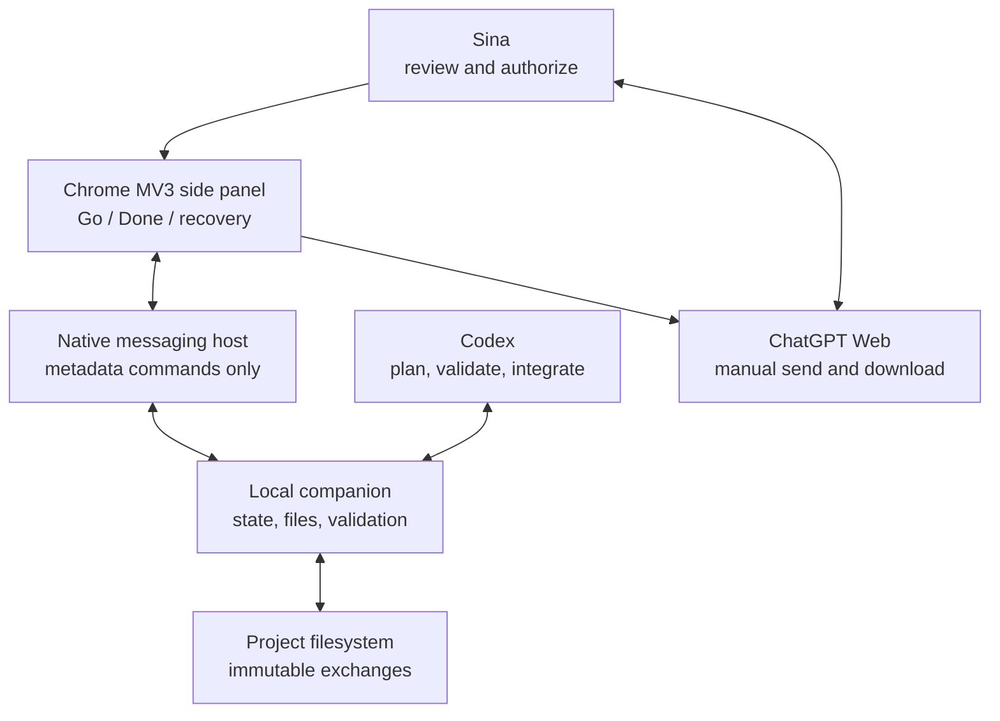
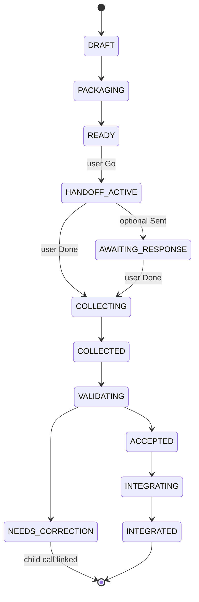

# ChatGPT Web Call Assistant — Candidate System Design

**Status:** Candidate design for Sina and Codex to approve before implementation  
**Prepared:** 2026-07-14  
**Scope:** Architecture and implementation specification only; no extension, companion service, or repository code has been implemented by this review.

## 1. How to read this document

The labels below separate evidence from judgment:

- **[DOCUMENTED]** means the statement is directly supported by an uploaded file or a cited current primary source.
- **[RECOMMENDATION]** means the proposed design choice.
- **[ASSUMPTION]** means a condition that must be verified during implementation.
- **[OPEN DECISION]** means Sina must approve a consequential choice before implementation crosses the stated gate.

The words **MUST**, **MUST NOT**, **SHOULD**, **SHOULD NOT**, and **MAY** are normative. “Must” is an acceptance requirement; “should” is the default unless a documented reason overrides it; “may” is optional.

## 2. Executive decision

**[RECOMMENDATION] Adopt a thin Chrome Manifest V3 side-panel extension connected to a local companion through Chrome native messaging.** The local companion, not the extension, is the durable authority for state, files, validation, and recovery. The extension is a visible, user-controlled console for the two main actions—**Go** and **Done**—plus explicit recovery choices. ChatGPT Web remains a human-operated intellectual worker. Codex remains the project manager, validator, and integrator.

The safe baseline deliberately does **not** scrape ChatGPT responses, read cookies, call private endpoints, control authentication, click Send, or silently inspect the page. Current OpenAI Terms of Use prohibit automatic or programmatic extraction of data or output and prohibit bypassing restrictions; they also require users to evaluate output appropriately. This is a load-bearing constraint, not merely a preference. ([OpenAI Terms of Use](https://openai.com/policies/terms-of-use/), effective 2026-01-01, accessed 2026-07-14.)

Accordingly:

1. **Go** MUST display the frozen request, exact files, expected result, and privacy notice; after the user authorizes it, Go opens the appropriate ChatGPT page, offers a one-click prompt copy, and reveals the already-prepared request folder. The user attaches the disclosed files and uses ChatGPT’s own Send control.
2. The user reviews the answer and downloads the requested files using ChatGPT’s normal controls.
3. **Done** MUST open a native, user-visible file-selection dialog. The user selects the downloaded response files. The local companion then associates, hashes, copies, validates, and records them. No response content is harvested from the ChatGPT page.
4. A later **input-only composer-assist adapter** MAY be explored, but only after policy/compliance approval, live compatibility tests, an immediate manual fallback, and Sina’s explicit approval. Output scraping and hidden submission remain prohibited in this design.

This architecture cannot guarantee “100% reliable” operation across browser, network, model, and user failures. It can provide fail-closed behavior, traceability, resumability, idempotency, explicit authorization, and recovery without silent loss or silent acceptance.

## 3. Governing product requirements

The product brief is the primary authority for user-facing intent. It requires Codex to manage the whole project; ChatGPT Web to receive bounded intellectual tasks; the user to authorize calls; project files to preserve continuity; and the extension to reduce mechanical effort while keeping outgoing content visible. See `chatgpt_web_call_assistant_brief(1).txt`, especially sections 2–6, 8, and 15–21 (lines 40–331, 411–445, and 691–874).

The existing manual protocol is the authority for current operational behavior. It establishes the reasoning gate, timestamped exchange folders, request/response separation, mandatory request and response JSON contracts, file-only Web delivery, manual transport by Sina, Codex validation, and retention of complete exchanges. See `F1D_AGENTS.md`, “ChatGPT Web — Universal Reasoning Gate”; and `CHATGPT_WEB_PROTOCOL.json`, JSON Pointers `/triage`, `/directory_contract`, `/workflow`, and `/delivery_contract`.

The recommended system MUST preserve these product invariants:

- Every intellectual call is bounded, identifiable, and linked to a project requirement.
- Every outgoing prompt and file is disclosed before authorization.
- No Web call is silently sent.
- No Web response is silently harvested or accepted.
- A produced response, a collected response, an accepted response, an integrated response, and a completed project are different states.
- The filesystem contains durable, human-inspectable evidence of what was sent and received.
- Codex independently validates important claims and treats model output as advisory.
- The manual workflow remains usable whenever the extension or companion is unavailable.
- Legacy exchanges remain intact.

## 4. Current-state reconstruction and audit

### 4.1 What the current system already accomplishes

| Capability | Documented behavior | Evidence | Disposition |
|---|---|---|---|
| Reasoning triage | Codex classifies every task; reasoning-heavy work is routed to a Web exchange. | `F1D_AGENTS.md`, “Triage Before Work”; `CHATGPT_WEB_PROTOCOL.json#/triage` and `#/gate` | **RETAIN**, then make the decision a persisted record. |
| Bounded request | Each call encodes objective, scope, authority, research permission, work, questions, artifacts, acceptance criteria, and stop condition. | `WEB_REQUEST_SCHEMA(1).json`; `WEB_REVIEW_REQUEST(1).json` | **RETAIN** and version. |
| Exchange isolation | One timestamped folder has `request/`, `response/`, and `EXCHANGE_MANIFEST.json`; calls are not mixed. | `CHATGPT_WEB_PROTOCOL.json#/directory_contract`; `EXAMPLE_EXCHANGE_MANIFEST.json` | **RETAIN** as the evidence layout. |
| Human authorization | Sina manually uploads request files and returns downloaded output files. | `F1D_AGENTS.md`, “Required Web Delivery”; `CHATGPT_WEB_PROTOCOL.json#/gate/transport` | **RETAIN** as a non-bypassable boundary. |
| Structured output | A main JSON attachment is mandatory and artifacts must be listed with hashes. | `WEB_RESPONSE_SCHEMA(1).json`; `PASTE_THIS_PROMPT(1).txt`; `EXAMPLE_WEB_RESPONSE.json#/artifacts_manifest` | **RETAIN**, strengthen cross-field validation. |
| Source authority | Each request ranks sources and limits how each may be used. | `WEB_REQUEST_SCHEMA(1).json#/properties/source_authority`; governing and example requests | **RETAIN**. |
| Validation and advisory use | Codex validates schema, files, hashes, criteria, and important claims before integration. | `CHATGPT_WEB_PROTOCOL.json#/workflow`; example manifest `/validation` | **RETAIN** and automate deterministic gates. |
| Traceable demonstrated exchange | The example records request/response status, receipt and validation times, expected files, hashes, and validation outcomes. | `EXAMPLE_EXCHANGE_MANIFEST.json` | **RETAIN** as a regression fixture, not a universal schema. |
| Silent file delivery | The Web response is supposed to contain files only, including on partial/blocking failure. | `PASTE_THIS_PROMPT(1).txt`; `CHATGPT_WEB_PROTOCOL.json#/delivery_contract` | **RETAIN** as an output request; do not treat self-report as proof. |

### 4.2 Prioritized gaps

#### Gap 1 — no durable lifecycle or idempotency (**critical**)

**[DOCUMENTED]** The brief lists useful statuses (`Prepared` through `Integrated`, `Failed`, and `Paused`) but delegates representation to Codex (`chatgpt_web_call_assistant_brief(1).txt`, lines 732–765). The protocol keeps one mutable `/active_request`; the example manifest has only `request_status` and `response_status`. There is no authoritative transition table, version check, event history, idempotency key, lock, retry rule, or crash-recovery rule.

**Impact:** Duplicate Go/Done actions, browser restarts, concurrent projects, and crashes can create ambiguous or contradictory state.

#### Gap 2 — response collection is unspecified and may cross a policy boundary (**critical**)

**[DOCUMENTED]** The brief says Done should “gather the response,” but also requires normal ChatGPT controls and forbids silently collecting unrelated page content (lines 198–212 and 691–707). Current OpenAI Terms prohibit automatic/programmatic extraction of data or output. The current files do not resolve this tension.

**Impact:** A naïve DOM scraper, network interceptor, or unattended browser bot would be unsafe, brittle, and potentially non-compliant.

#### Gap 3 — request/response identity is too weak (**critical**)

The request and response share `request_id`, but the request contract contains no immutable file inventory, sizes, or hashes. The response does not echo a digest of the exact package. A matching `request_id` therefore does not prove that the returned work corresponds to the bytes the user actually uploaded.

#### Gap 4 — whole-project completion is described but not represented (**critical**)

The brief defines project completion in terms of requirements, artifacts, review, contradictions, integration, and final audit (lines 768–793). No supplied contract represents a project, requirement, dependency, accepted evidence, unresolved issue, integration record, or final completion proof.

#### Gap 5 — the “universal” gate is stored in a defense-specific path (**major**)

`F1D_AGENTS.md` says the gate applies to every task, while both it and `CHATGPT_WEB_PROTOCOL.json#/directory_contract/exchange_root` hard-code a `docs/Defense/...` calls directory. This is a historical location, not a universal project model.

#### Gap 6 — one `active_request` cannot represent concurrency (**major**)

`CHATGPT_WEB_PROTOCOL.json#/active_request` is a single slot. It cannot safely represent multiple projects, multiple ready calls, a paused call alongside an active call, or parent/child revision lineage.

#### Gap 7 — the schemas validate shape, not completion integrity (**major**)

Specific weaknesses include:

- `WEB_REQUEST_SCHEMA(1).json#/properties/context` is unconstrained.
- Requested work IDs, question IDs, artifacts, filenames, and sources are not required to be unique.
- Input entries contain only `file` and `purpose`; no size, media type, digest, sensitivity, authority rank, or source snapshot.
- `WEB_RESPONSE_SCHEMA(1).json` does not require exactly the requested work/question/artifact IDs.
- `status: COMPLETE` is not conditionally tied to every work item being complete, every artifact being created, or limitations being resolved.
- An artifact with `status: CREATED` may still have `sha256: null`.
- `chat_text_emitted: false` and `generated_by_chatgpt_web: true` are self-assertions, not independently verifiable evidence.
- There is no `call_id`, `project_id`, `request_digest`, contract version distinct from protocol version, response time, parent call, revision reason, or validation profile.
- Web sources cannot record page title, direct URL, access date, fact-versus-inference, or supported claim in structured fields.

#### Gap 8 — no secrets, privacy, or retention gate (**major**)

The current package contract has no sensitivity classification, secret scan, exclusion reason, data-control reminder, retention choice, or approval evidence for sensitive files. OpenAI’s consumer data controls and retention behavior depend on account settings and chat mode. ([Data Controls FAQ](https://help.openai.com/en/articles/7730893-data-controls-faq); [Chat and File Retention Policies](https://help.openai.com/en/articles/8983778-chat-and-file-retention-policies-in-chatgpt), accessed 2026-07-14.)

#### Gap 9 — filename mutation is not safely normalized (**major**)

The governing request refers to filenames without duplicate suffixes, while the transported attachments include names such as `WEB_REVIEW_REQUEST(1).json`. Browsers also uniquify downloads. The existing system relies on humans and content inspection to reconcile names; the contract has no recorded original filename, normalized filename, or digest-based mapping.

#### Gap 10 — no implemented bridge, recovery, or test harness (**major**)

The current state is intentionally manual. There is no extension, companion, installer, health check, mocked ChatGPT surface, failure injection, or compatibility probe. This is a missing feature, not a defect in the working manual protocol.

### 4.3 Retain, extend, migrate, retire

| Element | Decision | Reason |
|---|---|---|
| Timestamped self-contained exchange | **RETAIN** | Strong human-readable audit evidence. |
| `request/` and `response/` separation | **RETAIN** | Prevents cross-call mixing. |
| Source-authority hierarchy | **RETAIN** | Essential intellectual-control mechanism. |
| Mandatory main response JSON and artifact manifest | **RETAIN** | Enables deterministic checks. |
| Manual transport fallback | **RETAIN permanently** | Reliability and policy-safe recovery path. |
| Advisory Web output plus Codex verification | **RETAIN** | Required because model output may be incomplete or wrong. |
| Exchange manifest | **EXTEND** | Add immutable package digest, lineage, state version, and complete file inventory. |
| Request/response schemas | **MIGRATE for new calls** | Introduce a versioned v3 contract while keeping v2 validation for legacy exchanges. |
| Defense-specific universal path | **MIGRATE** | New projects use a configurable project exchange root; legacy paths remain unchanged. |
| Singleton `active_request` | **RETIRE as authority** | Replace with queryable call records; MAY retain a derived convenience pointer. |
| Unverified response-page harvesting | **PROHIBIT** | Conflicts with safety requirements and current OpenAI Terms. |
| Mutable request package after Ready | **PROHIBIT** | Breaks disclosure and request/response binding. |
| Browser extension as durable store | **PROHIBIT** | MV3 service workers may terminate and extension storage is not the project record. |

## 5. Architecture alternatives

Scores are 1 (poor) to 5 (strong). “UI resilience” is the inverse of brittleness. Weights reflect the brief’s reliability and control priorities.

| Criterion | Weight | Extension-only | Thin extension + native companion | Extension + loopback HTTP service | Full browser automation/RPA |
|---|---:|---:|---:|---:|---:|
| Reliability and recovery | 20 | 2 | **5** | 4 | 2 |
| Security / least privilege | 15 | 3 | **5** | 3 | 1 |
| Maintainability | 15 | 3 | **4** | 4 | 1 |
| UI resilience | 15 | 2 | **4** | 4 | 1 |
| Portability | 10 | 4 | 3 | **4** | 2 |
| Implementation effort | 5 | **4** | 2 | 3 | 2 |
| Testability | 10 | 3 | **5** | **5** | 2 |
| Explicit user control | 10 | 4 | **5** | **5** | 1 |
| **Weighted score / 500** | **100** | **290 (58%)** | **435 (87%)** | **400 (80%)** | **145 (29%)** |

### Alternative A — extension only

The extension would keep state in `chrome.storage`, interact with tabs/content scripts, and monitor downloads.

- **Strength:** simplest installation and comparatively portable.
- **Failure:** it cannot safely own arbitrary project files or integrate directly with Codex’s filesystem. MV3 service-worker globals are lost when the worker stops, so state must be persisted; `storage.local` has a 10 MB default quota and is cleared when the extension is removed. ([Extension service-worker lifecycle](https://developer.chrome.com/docs/extensions/develop/concepts/service-workers/lifecycle); [chrome.storage](https://developer.chrome.com/docs/extensions/reference/api/storage), accessed 2026-07-14.)
- **Verdict:** insufficient as the durable project orchestrator.

### Alternative B — thin extension plus native companion (**recommended**)

The side panel owns presentation and user gestures. A registered native host owns durable state, validation, and file operations. Chrome native messaging pins the host to explicit extension origins and uses framed JSON over standard input/output. Native messaging is available to extension pages/service workers, not directly to content scripts; this supports a narrow trust boundary. ([Chrome native messaging](https://developer.chrome.com/docs/extensions/develop/concepts/native-messaging), accessed 2026-07-14.)

- **Strengths:** no listening network port; exact extension-origin allowlist; direct safe integration with project files; durable transactions; easy mock testing; clear separation of privileges.
- **Costs:** an installer/registration step is required. On Windows, a per-user HKCU native-host registration is needed. Cross-platform installers require adapters.
- **Verdict:** best balance for Sina’s Windows/Chrome environment and the product’s safety model.

### Alternative C — extension plus loopback HTTP/WebSocket companion

The extension talks to a local service on `127.0.0.1` using a session token.

- **Strengths:** language-agnostic, convenient development, and potentially easier multi-browser support.
- **Risks:** opens a local network attack surface; requires origin, CSRF, token, port-collision, firewall, CORS, lifecycle, and stale-service controls. Host permissions are needed for cross-origin extension fetches. ([Chrome cross-origin network requests](https://developer.chrome.com/docs/extensions/develop/concepts/network-requests), accessed 2026-07-14.)
- **Verdict:** credible fallback if native messaging proves unmaintainable, but not the default.

### Alternative D — full Playwright/CDP/RPA against the user’s authenticated ChatGPT

- **Strength:** highest apparent convenience.
- **Failures:** selector and UI brittleness, authentication/cookie exposure, ambiguous submission, difficult recovery, and a direct conflict with the no-hidden-automation product principle. Programmatic output extraction is prohibited by current OpenAI Terms.
- **Verdict:** reject for production. Playwright MAY be used against a local mock surface for extension tests, not to automate Sina’s live ChatGPT account.

### Supported API/app alternative

If OpenAI later offers a documented, subscription-compatible mechanism that directly supports these file exchanges, it SHOULD be evaluated as a replacement transport. The system MUST NOT invent or reverse-engineer a private ChatGPT endpoint. An API-first design is not assumed here because it changes the subscription/cost model and the user-authorized Web workflow.

## 6. Recommended component architecture



### 6.1 Codex

Codex MUST:

- classify work as labor or intellectual;
- create the project requirement graph and task dependencies;
- prepare bounded requests and select only necessary files;
- set source authority and acceptance criteria;
- request user decisions where consequential;
- independently validate important model claims;
- accept, reject, request correction, and integrate outputs;
- mark whole-project completion only when its invariants pass.

Codex MUST NOT treat a schema-valid response as intellectually correct merely because it is well formed.

### 6.2 Local companion

**[RECOMMENDATION]** Implement the companion in TypeScript on the current supported Node.js LTS, with SQLite for operational state and the exchange filesystem for evidence. This shares types and JSON Schema tooling with the extension while avoiding a new language boundary. The implementation MUST pin exact runtime and dependency versions after a repository inspection.

The companion MUST own:

- SQLite transactions, state versions, locks, and event records;
- package creation, canonical request digest, hashes, and immutability checks;
- secret/sensitivity preflight and exact disclosure data;
- safe path resolution under configured project roots;
- native file/folder dialogs and folder reveal;
- response staging, quarantine, hashing, schema validation, and artifact accounting;
- reconciliation of SQLite from exchange manifests/events;
- health status and metadata-only logs;
- manual-mode commands when the extension is unavailable.

It MUST NOT store or request OpenAI credentials, browser cookies, session exports, API keys, or authentication tokens.

### 6.3 Native messaging host

The native host MAY be the same executable as the companion in a restricted “native-message” entry mode. It MUST:

- register one exact extension origin in `allowed_origins`;
- accept only a versioned allowlist of commands;
- validate every message against a schema and verify the sender/binding;
- return metadata, IDs, and results, not project-file bytes;
- write diagnostics to `stderr`, never `stdout`, because stdout is the protocol channel;
- reject oversized, unknown, duplicated, or out-of-order messages;
- use OS-level per-user permissions.

Chrome currently limits a native-host-to-Chrome message to 1 MB and a Chrome-to-host message to 64 MiB. File bytes therefore MUST remain on disk rather than crossing this channel. ([Chrome native messaging](https://developer.chrome.com/docs/extensions/develop/concepts/native-messaging), accessed 2026-07-14.)

### 6.4 Chrome extension

The extension MUST be a thin MV3 extension with a side panel. Chrome’s side-panel API provides a persistent companion UI alongside a page and requires user interaction for programmatic opening. ([chrome.sidePanel](https://developer.chrome.com/docs/extensions/reference/api/sidePanel), accessed 2026-07-14.)

Baseline permissions SHOULD be limited to:

- `sidePanel`;
- `nativeMessaging`;
- `storage` for non-sensitive preferences and transient UI cache only.

The baseline MUST NOT request:

- `<all_urls>`;
- broad `host_permissions`;
- `cookies`;
- `debugger`;
- `webRequest` access to ChatGPT;
- `downloads`;
- `downloads.open`;
- persistent `tabs` access merely for URL/title inspection.

Opening a new tab does not require the broad `tabs` permission. ([chrome.tabs](https://developer.chrome.com/docs/extensions/reference/api/tabs), accessed 2026-07-14.) If a later input-assist capability is approved, it SHOULD request temporary or optional access rather than permanent broad access. Chrome recommends optional and minimum permissions, and `activeTab` grants temporary access following explicit user invocation. ([Declare permissions](https://developer.chrome.com/docs/extensions/develop/concepts/declare-permissions); [activeTab](https://developer.chrome.com/docs/extensions/develop/concepts/activeTab), accessed 2026-07-14.)

The extension MUST treat content scripts as untrusted. Chrome explicitly warns that content-script messages may be attacker-crafted and that data sent to a content script may leak to the page. ([Chrome message passing — security considerations](https://developer.chrome.com/docs/extensions/develop/concepts/messaging), accessed 2026-07-14.)

### 6.5 ChatGPT Web

ChatGPT Web MUST remain a user-operated service:

- The user selects the account/workspace/chat context.
- The user attaches the disclosed files.
- The user presses ChatGPT’s own Send control.
- The user reviews the answer.
- The user explicitly downloads the main JSON and artifacts.

The system MUST NOT assume a stable DOM, a private endpoint, a stable attachment-download URL, a stable usage cap, or a stable model selector.

### 6.6 Filesystem exchanges

The exchange folder remains the durable evidence boundary. For new v3 exchanges:

```text
<project_exchange_root>/calls/YYYY-MM-DD_HHMMSS_short_subject/
  EXCHANGE_MANIFEST.json
  CALL_STATE.json
  EVENTS.jsonl
  request/
    PACKAGE_MANIFEST.json
    WEB_REVIEW_REQUEST.json
    WEB_RESPONSE_SCHEMA.json
    PASTE_THIS_PROMPT.txt
    ...approved source files...
  response/
    ...user-selected Web files after collection...
  validation/
    COLLECTION_REPORT.json
    VALIDATION_REPORT.json
  quarantine/
    <collection_id>/...unaccepted candidates...
```

`request/` MUST be frozen after `READY`. Any byte change invalidates readiness and requires a new package generation. `response/` MUST contain only files selected for that exchange. Wrong, partial, or unbound candidates go to `quarantine/` and do not advance the call.

## 7. Responsibility and automation boundary

| Activity | Codex | Companion | Extension | User | ChatGPT Web |
|---|---|---|---|---|---|
| Decide labor vs intellectual work | Owns | Records | Displays | May override | None |
| Build task and select context | Owns | Packages/hashes | Displays exact list | Reviews | None |
| Authorize outgoing request | Proposes | Enforces preconditions | Presents Go | **Owns decision** | None |
| Open ChatGPT | None | Records binding | May open tab | Confirms destination | Hosts UI |
| Put prompt/files into composer | Prepares bytes | Reveals folder | Copy/reveal assist | **Attaches/pastes** | Native controls |
| Send | None | Never | **MUST NOT click** | **Clicks Send** | Receives input |
| Determine response complete | None | Never polls page | Does not scrape | **Reviews** | Produces answer |
| Download output | None | None | Does not intercept | **Uses normal controls** | Supplies download |
| Select files for collection | None | Opens native picker | Invokes on Done | **Selects/confirms** | None |
| Bind and validate response | Semantic review | Deterministic checks | Displays result | Can reject | None |
| Accept/integrate | **Owns with user authority** | Records atomically | Displays status | Final authority | None |

## 8. End-to-end lifecycle

### 8.1 Prepare

1. Codex creates or updates the project objective and requirement graph.
2. Codex classifies the task and records the reasoning-heavy assessment.
3. Codex creates a bounded request and selects the minimum necessary files.
4. The companion resolves every real path under approved roots, rejects symlinks/reparse points and unsafe names, records original and normalized names, calculates byte size and SHA-256, and performs secret/sensitivity preflight.
5. The companion validates all request JSON against pinned schemas.
6. It writes `PACKAGE_MANIFEST.json`, canonicalizes its hash-covered fields, and computes `request_digest` over the canonical package manifest. RFC 8785 provides a deterministic JSON representation suitable for repeatable hashes. ([RFC 8785](https://www.rfc-editor.org/rfc/rfc8785.html), accessed 2026-07-14.)
7. It atomically writes the exchange metadata and advances the call to `READY` only after a second hash pass succeeds.

### 8.2 Go

The side panel MUST show before authorization:

- project and call identity;
- task title, purpose, and reason it is intellectual work;
- exact prompt preview;
- exact file list with original name, displayed name, size, SHA-256 prefix, purpose, source authority, and sensitivity label;
- total file count/size and current upload-limit preflight;
- required output filenames and acceptance criteria;
- retention/data-control notice appropriate to the selected chat mode;
- `request_digest` prefix;
- any stale-package or changed-project warning.

On Go:

1. The extension sends `AUTHORIZE_GO(call_id, state_version, request_digest, idempotency_key)`.
2. The companion re-hashes the frozen request and checks `READY`, the state version, no conflicting lock, and no expired approval.
3. One SQLite transaction writes the state change and event. A repeated idempotency key returns the prior result instead of creating another authorization.
4. The extension creates or focuses one browser binding for that call and opens the configured ChatGPT destination.
5. It offers **Copy prompt** and **Reveal request folder**. Clipboard writing MUST require the user click; clipboard reading is never required.
6. The user attaches the disclosed files, pastes/reviews the prompt, and clicks ChatGPT Send.
7. The call remains `HANDOFF_ACTIVE`. The user MAY mark “Sent” for a more precise timestamp; otherwise Done later records `submission_confirmed_at_done`.

If the tab is lost, Go MUST NOT silently resubmit. The recovery UI asks whether the request was already sent, opens a new tab if requested, and records the uncertainty.

### 8.3 Response and Done

1. The user waits for ChatGPT Web, reviews the output, and uses the normal download controls for the main JSON and all artifacts.
2. The user presses Done in the side panel.
3. Done displays the expected files and launches a native multi-file picker. File access is therefore initiated by a direct user action. Browser file-picker APIs likewise require transient user activation; this is the correct security pattern even though the recommended implementation uses a native dialog to preserve local paths and large-file handling. ([File System Access API](https://developer.chrome.com/docs/capabilities/web-apis/file-system-access), accessed 2026-07-14.)
4. The user selects and confirms candidates. The companion receives paths from its own dialog—not page content, cookies, or network traffic.
5. The companion copies each candidate to exchange-local temporary files, fsyncs where supported, hashes, closes, reopens, verifies the hash, then atomically renames into place.
6. It rejects path aliases, duplicate normalized filenames, non-regular files, oversized JSON, executable files when not explicitly requested, archives that would require extraction, and files outside the user’s explicit selection.
7. It identifies the main JSON by expected filename and schema, checks `request_id`, and for v3 checks `call_id` and `request_digest`.
8. It cross-checks the artifact manifest against returned files, sizes, media types, and SHA-256 hashes.
9. If anything is missing, wrong, partial, unsafe, or ambiguous, candidates are retained in quarantine, the call does not advance to accepted, and the UI states exactly what to fix.
10. If deterministic checks pass, the call advances through `COLLECTED` and `VALIDATING`. Codex then performs intellectual/authority validation.

### 8.4 Accept, correct, integrate

- **Produced** means ChatGPT displayed something; it is not a persisted state unless the user confirms it.
- **Collected** means selected files are durably stored and bound to the call.
- **Structurally valid** means schemas, identities, hashes, filenames, and artifact accounting pass.
- **Accepted** means Codex and, where required, Sina approve the content against authority and criteria.
- **Integrated** means a recorded project mutation consumes the accepted output and passes its own checks.
- **Project complete** means every mandatory project invariant passes and a final audit has been accepted.

An incomplete or rejected response MUST produce a separate child correction/revision exchange with `parent_call_id`, the original request digest, prior response hashes, exact deficiencies, and new acceptance criteria. The original exchange remains unchanged.

## 9. Durable state machine

### 9.1 Canonical states

| State | Meaning | Owner of next decision |
|---|---|---|
| `DRAFT` | Request may change. | Codex |
| `PACKAGING` | Companion is copying, hashing, and validating. | Companion |
| `READY` | Frozen package passed all preflight and is visible to the user. | User |
| `HANDOFF_ACTIVE` | Go was authorized; user is transferring/sending in ChatGPT. | User |
| `AWAITING_RESPONSE` | User explicitly confirmed Send; optional precision state. | User |
| `COLLECTING` | Done selection/copy is in progress. | Companion |
| `COLLECTED` | Candidate response is durably bound; deterministic validation pending. | Companion |
| `VALIDATING` | Deterministic and/or Codex validation is active. | Companion/Codex |
| `NEEDS_CORRECTION` | Returned work cannot be accepted; a child call is required or pending. | Codex/User |
| `ACCEPTED` | Content and artifacts are approved but not necessarily merged. | Codex/User |
| `INTEGRATING` | Accepted output is being merged into the project. | Codex |
| `INTEGRATED` | Integration completed and verified. | Codex |
| `REJECTED` | User or Codex rejected the output with a recorded reason. | User/Codex |
| `FAILED` | A non-content operational failure requires recovery. | User/Companion |
| `CANCELLED` | User intentionally ended the call. Terminal. | User |
| `STALE` | Package can no longer be sent without renewed review. | User/Codex |

`PAUSED` is modeled as a flag with `paused_from_state`, reason, actor, and timestamp rather than a destructive state replacement. This preserves the exact resumption point.



### 9.2 Transition contract

Every transition MUST specify:

- actor and command;
- prior state and expected `state_version`;
- preconditions;
- idempotency key;
- one atomic database transaction;
- filesystem side effects and their staging/commit boundary;
- persisted event evidence;
- resulting state and incremented state version;
- retry classification (`SAFE_RETRY`, `USER_DECISION`, or `DO_NOT_RETRY`);
- user-visible outcome.

Key transitions:

| Transition | Initiator | Preconditions | Persisted evidence | Retry behavior |
|---|---|---|---|---|
| `DRAFT→PACKAGING` | Codex | Unique IDs; approved project root | task snapshot, actor, source set | Safe before freeze |
| `PACKAGING→READY` | Companion | schema pass; secret decision; all hashes pass | package manifest/digest, validation run | Rebuild into a new package generation |
| `READY→HANDOFF_ACTIVE` | User Go | digest unchanged; approval current; no conflict | approval event, exact disclosure snapshot, browser binding generation | Duplicate key returns same binding |
| `HANDOFF_ACTIVE→AWAITING_RESPONSE` | User optional Sent | active binding or explicit manual-mode assertion | confirmation method/time | Duplicate is no-op |
| `*→COLLECTING` | User Done | call eligible; no collection lock | collection ID, expected file set | Duplicate focuses current collection |
| `COLLECTING→COLLECTED` | Companion | atomic copies and identity binding pass | source names, stored names, hashes, sizes | Retry skips exact-hash duplicates |
| `COLLECTED→VALIDATING` | Companion/Codex | complete candidate set | validator versions and inputs | Safe retry; same inputs same run identity |
| `VALIDATING→ACCEPTED` | Codex/User | all mandatory gates pass | structural and semantic approvals | Reapproval requires new event |
| `VALIDATING→NEEDS_CORRECTION` | Codex | one or more mandatory gates fail | deficiency list and evidence | Creates one idempotent child-call proposal |
| `ACCEPTED→INTEGRATING` | Codex | integration target clean/known; lock held | integration plan and input hashes | User decision if prior result uncertain |
| `INTEGRATING→INTEGRATED` | Codex | post-integration verification passes | output paths/hashes/tests | Never infer after crash; reconcile evidence |

### 9.3 Exceptional behavior

- **Duplicate Go:** return the existing authorization and focus/reopen its binding; never create a second request.
- **Duplicate Done:** return the active collection or prior result; exact-hash files are no-ops.
- **Browser restart:** reload call state from the companion; browser tab IDs are treated as session hints, not durable identity.
- **Lost tab:** ask whether the request was sent. Never guess and never submit automatically.
- **Done too early:** show expected downloads and leave the call in `HANDOFF_ACTIVE`/`AWAITING_RESPONSE`.
- **Wrong files:** quarantine and report; do not overwrite response files or advance acceptance.
- **Partial download:** reject any candidate still changing, with browser partial extensions, size instability, or a failed parse/hash check.
- **Stale call:** require re-review if package bytes, authority decisions, required outputs, or project constraints changed. Time alone produces a warning; material change forces `STALE`.
- **Concurrent projects:** per-call locks allow independent work; a project-level integration lock serializes conflicting integrations.
- **State/database disagreement:** filesystem evidence is preserved; reconciliation reports the discrepancy and requires deterministic repair or human choice.

### 9.4 Invariants

1. A call MUST NOT enter `READY` without a complete, schema-valid, hash-verified package.
2. Go MUST NOT proceed if the current request digest differs from the disclosed digest.
3. No operation may change frozen request bytes in place.
4. No response may be accepted without a bound request identity, complete artifact accounting, and semantic review.
5. Every state change MUST have exactly one durable event and monotonically increasing state version.
6. Retried commands with the same idempotency key MUST produce the same logical result.
7. Ambiguous submission, collection, or integration MUST fail closed to a user decision.
8. Legacy exchanges MUST never be rewritten merely to index or migrate them.
9. No page output, cookie, token, or unrelated browsing content may be collected.
10. Project completion MUST be derived from requirements and evidence, never from the number of calls sent.

## 10. Durable data model and contracts

### 10.1 Source-of-truth rule

- The **filesystem exchange** is the long-term evidence of request and response bytes.
- **SQLite** is the transactional operational index and event store.
- `CALL_STATE.json` is a human-readable materialized snapshot, not an independent authority.
- `EVENTS.jsonl` mirrors committed events for portable audit/rebuild.
- If SQLite is lost, it MUST be rebuildable from manifests, snapshots, and events. If evidence conflicts, the system MUST not silently choose a winner.

SQLite provides transactional atomicity; WAL records commits separately from the original database and supports concurrent readers. The implementation SHOULD use `journal_mode=WAL`, `synchronous=FULL`, foreign keys, bounded busy timeouts, and tested backup/recovery behavior. ([SQLite WAL](https://sqlite.org/wal.html); [SQLite transactions](https://sqlite.org/lang_transaction.html), accessed 2026-07-14.)

### 10.2 Core records

| Record | Required fields / constraints |
|---|---|
| `project` | `project_id`, title, objective, root, exchange_root, state, state_version, completion_policy, created/updated times |
| `requirement` | stable `requirement_id`, source, text, mandatory flag, status, parent/dependencies, acceptance rule |
| `call` | `call_id`, `request_id`, project, type, parent/revision lineage, subject, state, state_version, package generation, request digest, timestamps |
| `package_file` | call, relative path, original name, displayed name, size, SHA-256, MIME, role, authority rank, sensitivity, scan outcome |
| `expected_output` | stable output ID, filename rule, media type, required flag, schema, acceptance criteria |
| `event` | event ID, call/project, state before/after, actor, command, idempotency key, timestamp, reason, metadata digest |
| `browser_binding` | call, generation, browser profile label, tab/session hint, created time, status; never cookies or auth state |
| `collection` | collection ID, call, selected filenames, source paths redacted from logs, status, start/end, failure reason |
| `response_file` | call, collection, original/stored name, size, SHA-256, MIME, role, validation status |
| `validation_run` | validator/profile versions, input hashes, checks, outcome, report path |
| `approval` | object, actor, decision, scope, evidence digest, timestamp |
| `integration` | accepted call, target paths, before/after hashes or commit, tests, status, rollback reference |
| `requirement_evidence` | requirement, accepted call/artifact, validation run, coverage judgment |

Unique constraints MUST cover `request_id`, `call_id`, `(call_id, normalized_response_name)`, and idempotency key within command scope.

### 10.3 `EXCHANGE_MANIFEST.json` v3

Required groups:

- contract and protocol versions;
- project/call/request identity and lineage;
- created time in UTC plus display timezone (`America/Toronto`);
- relative request, response, validation, and quarantine paths;
- package manifest path and `request_digest`;
- current materialized state and state version;
- exact expected outputs;
- collection/validation/integration references;
- legacy compatibility metadata when imported;
- no absolute paths, secrets, browser tokens, or content bodies.

### 10.4 `PACKAGE_MANIFEST.json`

For every outgoing file it MUST record:

- `file_id` stable within the call;
- role (`GOVERNING_REQUEST`, `RESPONSE_SCHEMA`, `PROMPT`, `SOURCE`, `PRIOR_OUTPUT`, or `OTHER`);
- original basename and packaged basename;
- relative packaged path;
- byte size, media type, SHA-256;
- source authority rank and purpose;
- sensitivity label and secret-scan result;
- user-disclosure flag.

The digest-covered portion MUST be canonicalized with RFC 8785 and hashed with SHA-256. Hashes detect accidental or unauthorized byte changes; they do **not** prove author identity. OS permissions and trusted local execution remain necessary.

### 10.5 Request contract v3

The v3 request SHOULD retain all v2 intellectual fields and add:

- `contract_version` separate from `protocol_version`;
- `project_id`, `call_id`, `parent_call_id`, and `revision_reason`;
- `package_manifest_filename` and `request_digest`;
- exact `inputs[].file_id`, hash, size, media type, authority rank, sensitivity, and purpose;
- unique IDs enforced across work, questions, and artifacts;
- `required_output_set` with filename and schema rules;
- `completion_policy` and `user_decisions_applied`;
- structured web source requirements including direct URL, title, access date, claim, and fact/inference classification;
- conditional schema rules tying research, work, questions, and artifacts to completion.

### 10.6 Response contract v3

The v3 response MUST echo:

- `project_id`, `call_id`, `request_id`, and `request_digest`;
- response contract version and generation timestamp;
- every requested work ID and question ID exactly once;
- every required artifact ID exactly once;
- each artifact’s filename, byte size, media type, and non-null SHA-256 when status is `CREATED`;
- structured sources with direct URL/title/access date and exact supported claim for Web sources;
- limitations and unresolved decisions;
- a delivery list that includes the main JSON itself.

Conditional validation MUST reject `status: COMPLETE` unless every required work item and artifact is complete, all required question IDs are present, and the delivery list is complete. This structural result remains advisory until the collector independently verifies it.

### 10.7 Validation and completion reports

- `COLLECTION_REPORT.json` records user selection, stored names, hashes, normalization, quarantine, and copy durability.
- `VALIDATION_REPORT.json` records validator versions, all deterministic checks, semantic-review status, and acceptance blockers.
- `PROJECT_COMPLETION.json` maps every mandatory requirement to accepted evidence, integration evidence, unresolved issues, final-audit evidence, and the user’s completion decision.

## 11. Compatibility and migration

1. Existing v2 exchange folders MUST remain byte-for-byte unchanged.
2. The companion MUST include a read-only legacy importer that validates existing JSON where possible, hashes the legacy tree, and records a `legacy_snapshot_digest` in SQLite.
3. The importer MUST infer only documented states. Unclear states are labeled `LEGACY_UNKNOWN`, not guessed.
4. New exchanges MAY initially remain in the existing `docs/Defense/chatgpt/calls/` root for the F1D project. New non-defense projects SHOULD use a configured project root such as `<project>/.chatgpt-web/calls/` or a user-approved docs path.
5. A dual validator MUST support current v2 schemas and new v3 schemas.
6. Correction calls MAY reference a legacy parent by its immutable snapshot digest without modifying the parent.
7. The manual instructions and current prompt remain a fallback until the vertical slice passes all regression and UAT gates.
8. `CHATGPT_WEB_PROTOCOL.json#/active_request` MAY be generated as a convenience view during transition, but the database and per-call manifest become authoritative for new calls.

## 12. Validation pipeline

### Gate A — request eligibility

- reasoning-heavy decision present;
- project, call, request IDs unique;
- scope and authority complete;
- source files resolve under approved roots;
- filenames/path casing safe on Windows and portable filesystems;
- no symlinks, reparse points, device files, or path traversal;
- secret/sensitivity review resolved;
- file count, byte size, media types, and current ChatGPT upload constraints preflighted;
- all request JSON schema-valid;
- package digest stable across two reads.

OpenAI currently documents a 512 MB per-file limit, 2 million tokens for text/document files, lower limits for spreadsheets/images, and rolling usage caps that may be reduced. These values MUST be configurable and treated as preflight hints; the live UI remains the runtime authority. ([File Uploads FAQ](https://help.openai.com/en/articles/8555545-file-uploads-faq), accessed 2026-07-14.)

### Gate B — Go authorization

- exact disclosure rendered;
- package unchanged and not materially stale;
- user approval recorded;
- selected ChatGPT destination visible;
- no automatic send or retry.

### Gate C — collection

- Done directly initiated by the user;
- every candidate explicitly selected;
- file is stable, regular, and safely copied;
- identity fields match;
- browser filename uniquification is recorded, not guessed;
- no overwrite of different bytes;
- raw candidate retained if validation fails.

### Gate D — structural response validation

- JSON parses within size/depth limits;
- correct schema/version;
- request/call/digest binding;
- complete and unique W/Q/A ID sets;
- artifact manifest exactly matches files;
- independent hashes match;
- `COMPLETE` cross-field conditions pass;
- direct Web citations include required metadata;
- no executable action is taken from response contents.

### Gate E — semantic and authority validation

Codex MUST check:

- every acceptance criterion;
- conflicts with higher-authority sources or approved decisions;
- unsupported claims and invented facts;
- requested scope and stop condition;
- important calculations, citations, and artifacts independently;
- whether critic/revision/final-audit work remains necessary.

### Gate F — integration and project completion

Integration MUST be a separate recorded operation with precondition checks, affected targets, verification, and rollback. A project can be `COMPLETE` only if:

- all mandatory requirements are `SATISFIED` with accepted evidence;
- every required artifact exists and validates;
- no critical/major blocker remains open;
- contradictions are resolved or explicitly accepted by the user;
- every accepted output that must affect the project is integrated;
- final assembled outputs pass consistency checks;
- the final audit is accepted;
- required user approval is recorded.

## 13. Security, privacy, and operational threat model

| Threat | Severity | Likelihood | Mandatory controls | Detection | Residual risk |
|---|---|---|---|---|---|
| Automatic extraction or hidden browser automation violates service rules | Critical | Medium | No response DOM/network scraping; no private APIs; manual Send/download; policy gate for future assist | Code review, permission audit, live behavior audit | Terms and UI can change; re-review each release |
| Compromised extension/content script triggers privileged file actions | Critical | Medium | Exact native `allowed_origins`; strict message schemas; capability-scoped commands; content scripts untrusted; no arbitrary paths/URLs | Rejected-command logs, security tests | Browser/extension zero-days |
| Excessive extension permissions expose browsing data | Major | Medium | Minimum baseline permissions; no downloads/all_urls/cookies/debugger; optional permissions only at feature use | Manifest diff gate, Web Store disclosure audit | Approved optional features expand surface |
| Local path traversal, symlink, or reparse attack | Critical | Medium | Approved roots; realpath/canonical-path checks; deny links/device files; safe relative names; atomic staging | Negative fixtures, path audit | OS/filesystem edge cases |
| Native host spoofing or message replay | Critical | Low | Exact extension origin; per-install identity; session nonce; monotonic state version; idempotency keys; per-user ACL | Origin/version/replay rejection events | Compromised local account can act as user |
| Secrets accidentally uploaded | Critical | Medium | Deny-pattern and entropy scan; sensitivity labels; exact disclosure; explicit override with reason; no hidden files | Preflight findings | Scanners have false negatives |
| Wrong response attached to wrong call | Critical | Medium | Request/call IDs, request digest, exact output set, user picker, independent hashes | Binding and artifact-accounting failures | Legacy v2 has weaker digest binding |
| Malicious model-generated file/JSON | Critical | Medium | Treat as untrusted data; parser limits; never execute; no auto archive extraction; extension never renders HTML; optional antivirus hook | MIME/signature mismatch, security scan | Novel parser/AV bypasses |
| ChatGPT UI change | Major | High | Baseline has no DOM dependency; manual fallback always available; optional adapter kill switch | Compatibility smoke test | Manual steps may increase temporarily |
| Browser/service-worker termination | Major | High | Local durable state; no global-variable authority; binding generations; resumable UI | Startup reconciliation | User may need to resolve send uncertainty |
| Duplicate Go/Done or concurrent calls | Major | Medium | Idempotency keys, optimistic state version, per-call locks, project integration lock | Duplicate/replay metrics | User may intentionally create separate calls |
| Model output is incomplete or wrong | Critical | High | Structural gates, authority checks, critic/revision, human review, advisory status | Validation findings | Intellectual errors can evade review |
| Chat/file retention or training is unsuitable | Major | Medium | Sensitivity gate; show Data Controls/retention choice; temporary-chat option; user approval | Package disclosure record | Provider handling depends on plan/settings |
| State loss, disk full, crash, or power loss | Major | Low–Medium | SQLite transactions/WAL/FULL sync; temp+atomic rename; fsync; backups; filesystem reconciliation | Startup integrity check, failure injection | Hardware/filesystem failures remain possible |
| Logs leak prompt/output content | Major | Medium | Metadata-only logs, redaction, per-user ACL, rotation; no content bodies by default | Log-content tests | Filenames can still be sensitive |
| Auth/session theft | Critical | Low | Never read cookies/tokens; no debugger/CDP; no stored browser profile; user logs in directly | Permission/code audit | Malware outside system scope |
| Dependency/update compromise | Critical | Low | Lockfiles, checksums, no remote extension code, signed releases, reviewed updates, SBOM | Supply-chain scan and signature verification | Trusted dependency compromise |
| Stale request sends superseded information | Major | Medium | Freeze digest, material-staleness rules, re-review on changed authority/requirements | Staleness diff | User may consciously send an old snapshot |

Chrome’s security guidance recommends minimum permissions; Chrome Web Store policy requires the narrowest permissions necessary and transparent handling of user data. ([Stay secure](https://developer.chrome.com/docs/extensions/develop/security-privacy/stay-secure); [Chrome Web Store User Data FAQ](https://developer.chrome.com/docs/webstore/program-policies/user-data-faq), accessed 2026-07-14.)

### Privacy defaults

- No telemetry leaves the machine by default.
- No prompt, source content, or response body is written to operational logs.
- Filenames SHOULD be redactable in logs and support bundles.
- The user MUST see a sensitivity summary before Go.
- Consumer-account projects SHOULD show whether “Improve the model for everyone” is enabled when the user can verify it; the extension MUST NOT scrape settings to discover this.
- Temporary Chat MAY be recommended for sensitive bounded calls, with the warning that it changes chat history/continuity behavior.
- Local exchange retention is user-controlled and separate from OpenAI retention.

## 14. Observability and audit trail

Every committed event SHOULD contain:

- project/call/event IDs;
- UTC timestamp and display timezone;
- actor and command;
- prior/resulting state and state versions;
- idempotency key hash;
- request/response digest prefixes;
- result code and structured failure taxonomy;
- software/schema/validator versions;
- no content body or credential.

Required health indicators:

- native host registered and reachable;
- extension/companion protocol compatible;
- database integrity and migration version;
- configured project roots reachable;
- disk space above threshold;
- stale locks cleared safely;
- manual fallback instructions available.

Useful local metrics include package-preflight failure type, duplicate-action suppression, recovery success, collection validation failures, correction-call rate, and acceptance-to-integration lag. These are diagnostic, not project-completion evidence.

## 15. Failure taxonomy and recovery playbooks

| Failure | System response | User recovery | State result |
|---|---|---|---|
| Extension missing/disabled | Do not alter call | Use manual exchange protocol | Existing state unchanged |
| Native host missing/version mismatch | Show exact setup failure; no Go | Repair/reinstall or use manual mode | `READY` retained |
| Go package hash changed | Block and invalidate approval | Repackage and review again | `STALE` |
| ChatGPT tab closed before known send | Never resend | Choose “not sent—reopen” or “already sent” | `HANDOFF_ACTIVE` with decision event |
| Network/model interruption | No polling or auto retry | Continue/retry in ChatGPT; if new intellectual attempt, create/link a child call | Awaiting user |
| User presses Done with no files | Show expected set | Download/select files | No advancement |
| Browser adds `(1)` to filename | Validate schema/identity/hash, record original; normalize only if unambiguous | Confirm candidate | Collected or quarantined |
| Wrong request ID/digest | Quarantine | Select correct files or create explicit import decision | No acceptance |
| Missing artifact | Preserve all returned files and report missing ID | Create correction child call | `NEEDS_CORRECTION` |
| Invalid JSON/schema | Preserve raw bytes; generate validation report | Correction child call | `NEEDS_CORRECTION` |
| Semantic conflict | Never auto-integrate | Sina/Codex reject, revise, or explicitly override | `REJECTED` or `NEEDS_CORRECTION` |
| Crash during copy | Ignore incomplete temp file on restart; verify source/target hashes | Retry Done | Prior durable state |
| Crash after files copied before DB commit | Reconcile unclaimed files; require deterministic match or user choice | Confirm recovery | `COLLECTED` only after commit |
| Disk full/permission denied | Abort without partial acceptance | Free space/fix permission; retry | Prior durable state or `FAILED` |
| Integration fails | Preserve accepted exchange; roll back only the integration mutation | Repair target and retry approved plan | `ACCEPTED` |

## 16. Requirements traceability

| Product requirement | Design mechanism | Verification |
|---|---|---|
| Codex manages entire project | project/requirement/call/integration records | requirement-coverage report and final completion gate |
| Labor vs intellectual work | persisted triage assessment | every call has classification and trigger evidence |
| Bounded context | package manifest with purpose/authority | file disclosure and minimum-context review |
| User controls every call | Go authorization plus native ChatGPT Send | UAT observes no send without user action |
| Exact outgoing visibility | frozen prompt/files/hashes in side panel | disclosure snapshot equals request digest |
| Go reduces mechanics | open destination, copy prompt, reveal prepared folder | UAT time/actions and zero manual file search |
| Done collects safely | user-selected native picker + deterministic binding | wrong/unrelated files cannot be silently collected |
| No silent partial success | layered states and validation gates | failure-injection tests |
| Long-term memory in files | immutable exchange plus rebuildable index | database rebuild from fixtures |
| Critic/revision/integration/final audit | typed calls with parent/dependency lineage | workflow fixture covering each call type |
| Pause/reject/override | persisted flags/decisions | restart/resume/reject UAT |
| Whole-project proof | requirement-evidence and completion records | no completion with any mandatory blocker |
| Maximum safety/reliability, not literal guarantee | fail-closed invariants, fallback, risk disclosure | release gate and residual-risk review |

## 17. Consequential open decisions for Sina

| Priority | Decision | Options | Recommendation | Consequence |
|---:|---|---|---|---|
| 1 | Safe automation ceiling | A: manual Send/download with Go/Done assist; B: experimental input-only DOM staging; C: full browser automation | **A for baseline**; consider B only after policy approval; reject C | Determines policy, brittleness, and permission risk |
| 2 | Done collection | A: native user file picker; B: optional Chrome downloads metadata/candidate monitoring | **A** | A needs one explicit selection; B sees broader download metadata and needs extra permission |
| 3 | Local bridge | Native messaging vs loopback service | **Native messaging** | Native requires installer; loopback adds network attack surface |
| 4 | New contract version | Keep stretching v2 vs introduce v3 with dual validator | **v3** | Cleaner integrity rules; requires migration tooling |
| 5 | New project exchange root | Keep all projects under `docs/Defense` vs per-project configurable root | **Per-project root; preserve legacy** | Removes defense-specific coupling |
| 6 | Chat isolation | New chat per call, designated project chat, or reuse | **New chat per call by default** | Reduces hidden context; gives up conversational continuity unless packaged |
| 7 | Sensitive-call mode | Normal history, Temporary Chat, or do-not-send | **Per-call classification and explicit choice** | Affects retention, history, memory, and training settings |
| 8 | Pilot distribution | Unpacked developer install, private signed package, or Web Store | **Single-user developer pilot, then signed private release** | Fast validation first; distribution hardening later |
| 9 | Local retention | Indefinite, project-defined, or automatic expiry | **Project-defined; no automatic deletion in first release** | Protects audit history but consumes disk and retains sensitive data |
| 10 | Clipboard behavior | Never use clipboard vs user-click copy with warning/clear option | **User-click copy only** | Convenience with temporary clipboard exposure |

No implementation SHOULD begin beyond baseline tests until decisions 1–5 are approved. Decisions 6–10 MUST be resolved before their corresponding release features.

## 18. Research evidence ledger

All Web sources below were accessed on **2026-07-14**. “Fact” is documented; “Inference” is the architectural consequence drawn here.

| Source | Documented fact used | Design inference |
|---|---|---|
| [OpenAI Terms of Use](https://openai.com/policies/terms-of-use/) | Terms effective 2026-01-01 prohibit automatic/programmatic extraction of data/output and bypassing restrictions; output requires evaluation. | No DOM/network response harvesting, hidden retries, or private endpoints; keep human review. |
| [OpenAI File Uploads FAQ](https://help.openai.com/en/articles/8555545-file-uploads-faq) | Current per-file/token/type and rolling upload limits; limits may change. | Preflight limits are configurable and live UI failure is recoverable. |
| [OpenAI Data Controls FAQ](https://help.openai.com/en/articles/7730893-data-controls-faq) | Users can control whether conversations improve models. | Show a privacy decision; do not scrape settings. |
| [OpenAI Chat and File Retention Policies](https://help.openai.com/en/articles/8983778-chat-and-file-retention-policies-in-chatgpt) | Chats/files have plan/chat-mode retention behavior; deletion can take up to 30 days with exceptions. | Sensitivity and retention must be explicit before Go. |
| [Chrome native messaging](https://developer.chrome.com/docs/extensions/develop/concepts/native-messaging) | Exact allowed extension origins, OS registration, JSON framing, message limits, and extension-context restrictions. | Use a metadata-only native bridge and exact-origin registration. |
| [Chrome extension service-worker lifecycle](https://developer.chrome.com/docs/extensions/develop/concepts/service-workers/lifecycle) | Workers may terminate; global variables are lost; persist state. | Extension cannot own authoritative call state. |
| [chrome.storage](https://developer.chrome.com/docs/extensions/reference/api/storage) | Extension storage persists across worker restarts but has quotas and access-level considerations. | Keep only preferences/cache there; durable project data stays local. |
| [chrome.sidePanel](https://developer.chrome.com/docs/extensions/reference/api/sidePanel) | Side panels accompany browsing and opening may be tied to user interaction. | Use side panel as calm Go/Done UI. |
| [chrome.tabs](https://developer.chrome.com/docs/extensions/reference/api/tabs) | Creating/navigating tabs generally does not need the broad `tabs` permission; tab IDs are session-scoped. | Open ChatGPT with minimal permission; never treat tab ID as durable call identity. |
| [activeTab](https://developer.chrome.com/docs/extensions/develop/concepts/activeTab) | Temporary page access follows explicit user invocation and ends on navigation/close. | If input assist is ever approved, prefer temporary/optional scope. |
| [Chrome content scripts](https://developer.chrome.com/docs/extensions/develop/concepts/content-scripts) | Content scripts can access/change DOM but run in isolated worlds and have limited APIs. | DOM capability exists but is not a reliable or trusted state boundary. |
| [Chrome message passing](https://developer.chrome.com/docs/extensions/develop/concepts/messaging) | Content-script messages may be attacker-crafted; privileged messages must be validated. | Strict command schemas and capability allowlists are mandatory. |
| [Chrome permissions](https://developer.chrome.com/docs/extensions/develop/concepts/declare-permissions) | Chrome recommends optional/minimum permissions. | No downloads/all-sites/debugger baseline permissions. |
| [Chrome Web Store User Data FAQ](https://developer.chrome.com/docs/webstore/program-policies/user-data-faq) | Store policy requires narrow permissions and transparent, limited user-data use. | Permission and privacy audits are release gates. |
| [Chrome File System Access API](https://developer.chrome.com/docs/capabilities/web-apis/file-system-access) | File selection requires user gesture and explicit permission. | Done should use explicit user selection, not silent folder scans. |
| [SQLite WAL](https://sqlite.org/wal.html) and [transactions](https://sqlite.org/lang_transaction.html) | WAL/transactions provide atomic commit and rollback behavior. | Use SQLite for state/events with crash tests and filesystem reconciliation. |
| [JSON Schema 2020-12](https://json-schema.org/specification) | Current schema dialect separates core and validation. | Keep pinned schema versions and conditional integrity validation. |
| [RFC 8785 — JSON Canonicalization Scheme](https://www.rfc-editor.org/rfc/rfc8785.html) | Deterministic JSON representation supports repeatable hashing. | Canonicalize package manifests before request-digest hashing. |
| [Playwright extension testing](https://playwright.dev/docs/chrome-extensions) | Extension tests use Chromium persistent contexts; browser flags have constraints. | Test the extension against a local mock surface; reserve live ChatGPT for manual UAT. |

## 19. Acceptance criteria for this candidate design

This design is ready for implementation planning only if Sina and Codex agree that:

- the native-companion architecture is approved;
- the baseline will not scrape or automatically extract ChatGPT output;
- manual ChatGPT Send and download remain explicit user actions;
- Done uses explicit native file selection in the first release;
- v2 history stays immutable while new contracts are versioned;
- the manual protocol remains available through every rollout phase;
- “100% safe/reliable” is treated as a fail-closed design ambition, not a guarantee;
- open decisions are resolved at the stated gates.

The companion roadmap in `CHATGPT_WEB_CALL_ASSISTANT_IMPLEMENTATION_ROADMAP.md` defines the smallest coherent vertical slice, tests, evidence, and rollback criteria.
